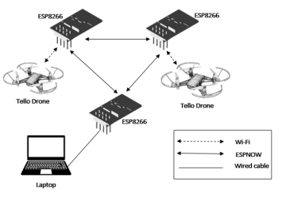
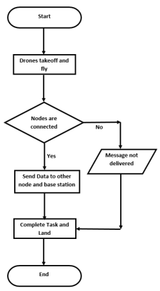

# Communication between two Unmanned Aerial Systems

The use of flying platforms such as unmanned aerial vehicles (UAVs), popularly known as drones, is rapidly growing. In particular, with their inherent attributes such as mobility, flexibility, and adaptive altitude, UAVs admit several key potential applications in wireless systems. Usually, UAV - UAV communication has the potential to create an ad-hoc network and will reduce the tedious hops from source to destination. In this project, we engineer a working solution for establishing communication between two Tello Drones using ESP8266 microcontrollers with Node MCU as its firmware. The objective is to demonstrate the use of UAV-to-UAV communication and coordination in realistic, operational flight environment. The communication protocols involved in this design are IEEE 802.11 and ESPNOW. The drones will be able to exchange data with each other and this can also be monitored from the base station.

## Competition

We are Team Amrita Ciphers from Amrita School of Engineering Bangalore. This project was done for **Innovation Challenge in Small Unmanned Aircraft System Communications** organized by IEEE VTS Bangalore Chapter and IEEE Bangalore Section.

The team came Runners-Up.
## Hardware Used
1) Ryze DJI Tello Drone
2) ESP8266 Microcontroller
3) Lithium Ion Batteries
## Tools and Software Used
1) Ryze DJI Tello Drone SDK 2.0
2) Arduino IDE
## Design Model
The design model is to establish communication between two Tello Drones using ESP8266 microcontrollers with the help of ESPNOW protocol. Two ESP8266 microcontrollers are mounted on top of the drones. The base station which only receives data will also be an ESP8266 microcontroller which will be connected with the other two microcontrollers using ESPNOW protocol.

Tello Drones are be connected to the Microcontrollers using Wi-Fi. The Drones will receive instructions or commands from the Nodes which are pre-programmed using Arduino IDE. The Drones will also be able to send values to other Nodes which will then be received by the base station. The data received by the base station can be seen through the Serial Monitor.

Two Lithium Ion Batteries of 3.7 V and 650 mah are used to supply voltage to the Microcontrollers which will be mounted on top of the Drones
## Working Algorithm

## Demo

The demo of the prototype is provided here [Demo](https://youtu.be/6-_PHmgnRRg)

## Documentation

The documentation for the project is provided here
[Documentation](https://github.com/Shivkumar25/Communication-between-two-Unmanned-Aerial-Systems/blob/main/Amrita%20Ciphers%20Project%20Documentation.pdf)

## Future Scope
This design with the help of Tello drones is just a small prototype to demonstrate UAV - UAV Communication. This can be improved by using bigger and developed drones with the same procedure for performing various applications based on disaster management. The number of drones can also be increased. The data or information may not be restricted to only Battery, Temperature, Speed, Height, Acceleration, Barometer and Time of flight of the Drones but also Images and Live Video Stream which will be beneficial to identify Human beings and other living creatures during floods and various other natural calamities.
## Team Members

- [Shivkumar](https://www.linkedin.com/in/shivkumar-sankar/) **(Team Lead)**
- [Palli Ashish](https://www.linkedin.com/in/palli-ashish-545b07120/)
- [K Tejaswini](https://www.linkedin.com/in/tejaswinikurre/)
- [Prajwal K.S](https://www.linkedin.com/in/prajwal-k-s-229a13156/)
- [Palanki Amitasree](https://www.linkedin.com/in/palanki-amitasree-893a55176/)
- [Nippun Kumar A.A.](https://www.nippunkumaar.in/home) **(Mentor)**

## Acknowledgements

 - [ESP8266](https://randomnerdtutorials.com/projects-esp8266/)
 - [Controller Code](https://github.com/SweiLz/NodeMCU-TelloDrone)
 - [Tello SDK](https://dl-cdn.ryzerobotics.com/downloads/Tello/Tello%20SDK%202.0%20User%20Guide.pdf)

